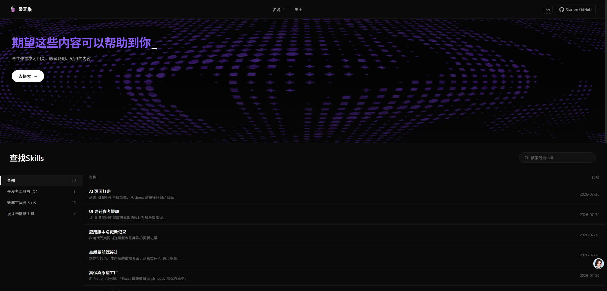

<div align="right">
  <a href="#english">🌐 English</a> · <a href="#chinese">简体中文</a>
</div>

<a id="english"></a>

# Mulberry

> **🎯 No database. No server. No DevOps.**
> A personal blog & portfolio template powered by **React + Vite + Vercel**.
> Content lives in a GitHub repo. Deploy with one click. Free forever.



[](LICENSE)
[](https://vercel.com/new/clone?repository-url=https%3A%2F%2Fgithub.com%2Fnothingtosayyy%2FMulberry-web)
[](https://react.dev)
[](https://vitejs.dev)
[](#-why-mulberry)
[](#-why-mulberry)
[](https://github.com/nothingtosayyy/Mulberry-web/pulls)

🌐 **Live demo:** [mulberrytian.vercel.app](https://mulberrytian.vercel.app/)

## 🎯 Why Mulberry?

Most blog templates require you to set up a database, configure a server, manage a CMS, and pay for hosting.

Mulberry skips all of that:

| | Traditional blog | Mulberry |
|---|---|---|
| **Database** | MySQL / Postgres | ✅ None — Markdown files in a GitHub repo |
| **Server** | Node.js / PHP / Django | ✅ Static files + 1 Edge Function (read-only proxy) |
| **Hosting** | VPS ($5+/mo) | ✅ Vercel free tier (generous limits) |
| **Content updates** | Log in to admin panel | ✅ Push a `.md` file to GitHub |
| **Backups** | Manual dumps | ✅ Git history is your backup |
| **Domain** | Configure DNS / SSL | ✅ Free `*.vercel.app` subdomain (or your own) |

**If you can use GitHub, you can run Mulberry.** No command line required for content updates — just edit Markdown in the GitHub web editor.

## 🚀 60-Second Deploy

Click the button → wait 30 seconds → your site is live.

[](https://vercel.com/new/clone?repository-url=https%3A%2F%2Fgithub.com%2Fnothingtosayyy%2FMulberry-web)

That's it. No environment variables to set. No database to provision. No build configuration to write.

## ✨ Features

- 📝 **GitHub-as-CMS** — Write posts in Markdown, push to GitHub, site auto-updates (no rebuild needed)
- 🔍 **SEO-ready** — Open Graph / Twitter Card / JSON-LD (Article / WebSite / Person) / sitemap.xml / robots.txt
- 🌗 **Dark mode** — Follows system + manual toggle, no flash on load
- 📱 **Responsive** — Desktop, tablet, mobile
- 🖼 **Reading experience** — One-click code copy, image lightbox, route progress bar
- 📡 **RSS / Atom feed** — Generated at build time
- 🎨 **Theme via CSS variables** — Change `--accent` and the whole site updates
- 🔗 **Share button** — One-click link copy for WeChat / Weibo / Twitter
- 📊 **Lightweight analytics** — Optional: busuanzi (PV/UV) + Turso (per-article views)

## 🛠 Tech Stack

| Layer | Choice | Why |
|---|---|---|
| Frontend | React 18 + react-router-dom v6 | Industry standard, huge ecosystem |
| Build | Vite 5 | Fast HMR, tiny config |
| Hosting | Vercel | Free tier, automatic HTTPS, global CDN |
| Server-side | Vercel Edge Functions | Read-only proxy to GitHub raw files |
| Data | GitHub repos (Markdown + frontmatter) | Versioned, public, free |
| Rendering | marked + custom `enhanceHtml` | Injects code-copy buttons + lightbox hooks |
| Styling | Plain CSS + CSS variables | No build step for styles, instant theme switch |
| Stats (optional) | busuanzi + Turso (libSQL) | Free, edge-deployed, no auth needed |

**No stateful services. No Docker. No `docker-compose.yml`. No migrations. No environment secrets to leak.**

## 📂 Project Structure

```
mulberry-web/
├── api/                       # 1 Edge Function: /api/raw (read-only GitHub proxy)
├── src/
│   ├── pages/                 # HomePage / WordListPage / WordPage / DetailPage / AboutPage / NotFound
│   ├── components/            # SEO / MarkdownBody / Lightbox / RouteProgressBar / ShareButton / ...
│   ├── hooks/                 # useSkillData / useArticles / useTheme
│   ├── utils/                 # clipboard / enhanceMarkdown
│   ├── context/               # ToastContext
│   ├── styles/                # All theme variables + per-page CSS
│   └── App.jsx + main.jsx     # Routing + entry
├── public/                    # Build-time data: index.json / articles.json / rss.xml / sitemap.xml
├── scripts/                   # build-index / build-articles / build-rss / build-sitemap
├── docs/                      # github-topics.md / seo-prompts.md / screenshots/
├── index.html                 # Site-level JSON-LD + GSC verification meta
├── vercel.json                # SPA fallback + cache headers
└── package.json
```

## 📝 Use as a Template (3 Steps)

1. **Click "Use this template"** on the GitHub repo page (or fork it)
2. **Edit `src/components/SEO.jsx`** — change `SITE_NAME`, `SITE_URL`, `OG_DEFAULT`, default description
3. **Replace content** — fork the content repos and put your Markdown under `cat/slug/README.md`:
   - [`Mulberry-SKILL`](https://github.com/nothingtosayyy/Mulberry-SKILL) — for project/collection entries
   - [`Mulberry-word`](https://github.com/nothingtosayyy/Mulberry-word) — for blog posts

That's it. Push to your repo → Vercel auto-deploys → your site is live with your content.

## 🌐 Local Development

```bash
# 1. Clone (with submodules or separate clones)
git clone https://github.com/nothingtosayyy/Mulberry-web.git my-site
cd my-site

# 2. Install
npm install

# 3. Clone content repos
git clone https://github.com/nothingtosayyy/Mulberry-SKILL.git data-repo
# (optional) git clone https://github.com/nothingtosayyy/Mulberry-word.git data-word

# 4. Generate the static index
npm run build:index

# 5. Run dev server
npm run dev
# → http://localhost:5173
```

## 🎨 Customization

| Want to change | Edit |
|---|---|
| Site name, URL, OG image | `src/components/SEO.jsx` + `index.html` |
| Theme color / font | `src/styles/*.css` — look for `--accent`, `--bg`, `--fg` |
| Add a new content category | `data-repo/categories.json` (auto-discovered) |
| Add a new page | Create `src/pages/MyPage.jsx` + add a `<Route>` in `App.jsx` |
| Replace analytics | Remove busuanzi `<script>`, plug in Plausible / Umami |

## 📜 License

MIT — use, modify, commercialize freely. Attribution appreciated but not required.

---

<p align="center">
  <sub>⭐ Star this repo if it helped you — it helps others find it.</sub>
</p>

---

<details>
<summary><strong>🇨🇳 简体中文(点击展开)</strong></summary>

<a id="chinese"></a>

# 桑葚集 · Mulberry

> **🎯 无数据库。无服务器。零运维。**
> 一款**个人 blog / 作品集 / 工具收藏模板**。React + Vite + Vercel。
> 内容存 GitHub,一键部署,永久免费。


🌐 **在线浏览:** [mulberrytian.vercel.app](https://mulberrytian.vercel.app/)

## 🎯 为什么选 Mulberry?

| | 传统 blog | Mulberry |
|---|---|---|
| **数据库** | MySQL / Postgres | ✅ **不需要** — Markdown 文件存 GitHub 仓库 |
| **服务器** | Node.js / PHP / Django | ✅ 静态文件 + 1 个 Edge Function(只读代理) |
| **托管** | VPS(¥30+/月) | ✅ Vercel 免费额度(够个人站用) |
| **更新内容** | 登录后台编辑器 | ✅ 推送一个 `.md` 文件到 GitHub |
| **备份** | 手动导出 | ✅ Git 历史就是你的备份 |
| **域名 / HTTPS** | 配置 DNS / SSL | ✅ 免费 `*.vercel.app` 子域名(或绑定自有域名) |

**只要你会用 GitHub,就能跑 Mulberry。** 内容更新甚至不需要命令行 — 在 GitHub 网页编辑器里改 Markdown 即可。

## 🚀 60 秒部署

点按钮 → 等 30 秒 → 站点上线。

[](https://vercel.com/new/clone?repository-url=https%3A%2F%2Fgithub.com%2Fnothingtosayyy%2FMulberry-web)

就这样。**不用配环境变量、不用建数据库、不用写 build 配置。**

## ✨ 特性

- 📝 **GitHub 当 CMS** — Markdown 写文章,推到 GitHub,站点自动更新(无需 rebuild)
- 🔍 **SEO 完整** — OG / Twitter / JSON-LD(Article / WebSite / Person)/ sitemap / robots
- 🌗 **暗色模式** — 跟随系统 + 手动切换,无闪烁
- 📱 **响应式** — 桌面 / 平板 / 手机
- 🖼 **阅读体验** — 代码块一键复制 / 图片灯箱 / 路由进度条
- 📡 **RSS / Atom** — build 时生成
- 🎨 **主题用 CSS 变量** — 改一个 `--accent` 全站变色
- 🔗 **分享按钮** — 一键复制链接(微信 / 微博 / Twitter 通用)
- 📊 **轻量统计** — 可选:不蒜子(PV/UV)+ Turso(每篇文章阅读数)

## 📂 项目结构

```
mulberry-web/
├── api/                       # 1 个 Edge Function:/api/raw(只读代理 GitHub)
├── src/
│   ├── pages/                 # HomePage / WordListPage / WordPage / DetailPage / AboutPage / NotFound
│   ├── components/            # SEO / MarkdownBody / Lightbox / RouteProgressBar / ShareButton / ...
│   ├── hooks/                 # useSkillData / useArticles / useTheme
│   ├── utils/                 # clipboard / enhanceMarkdown
│   ├── context/               # ToastContext
│   ├── styles/                # 主题 + 各页面 CSS
│   └── App.jsx + main.jsx     # 路由 + 入口
├── public/                    # build 时数据:index.json / articles.json / rss.xml / sitemap.xml
├── scripts/                   # build-index / build-articles / build-rss / build-sitemap
├── docs/                      # github-topics.md / seo-prompts.md / screenshots/
├── index.html                 # 站点级 JSON-LD + GSC 验证
├── vercel.json                # SPA fallback + 缓存策略
└── package.json
```

## 📝 用作模板(3 步)

1. **点 "Use this template"**(或 Fork)
2. **改 `src/components/SEO.jsx`** 里的 `SITE_NAME / SITE_URL / OG_DEFAULT`
3. **换内容** — fork 内容仓库,把 Markdown 放进 `cat/slug/README.md`:
   - [`Mulberry-SKILL`](https://github.com/nothingtosayyy/Mulberry-SKILL) — 工具 / 项目 / 收藏
   - [`Mulberry-word`](https://github.com/nothingtosayyy/Mulberry-word) — 随笔 / 文章

完了。推到仓库 → Vercel 自动部署 → 站点上线。

## 🌐 本地开发

```bash
git clone https://github.com/nothingtosayyy/Mulberry-web.git my-site
cd my-site
npm install
git clone https://github.com/nothingtosayyy/Mulberry-SKILL.git data-repo
npm run build:index
npm run dev   # http://localhost:5173
```

## 📜 许可

MIT — 自由使用、修改、商用。

---

<p align="center">
  <sub>如果这个项目对你有帮助,欢迎 ⭐️ Star!</sub>
</p>

</details>
